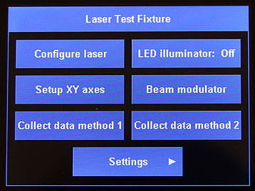

# Arduino Touch UI

This library is a simple touchscreen user interface for building Arduino applications.  Adding buttons and menus to your sketch is as-easy-as filling in a table.  The library also includes many functions for displaying your own data.  This library requires a 32 bit processor and a 320x240 ILI9341 LCD touch screen display .

## Documentation:
Usage of the *Arduino Touch UI* is nearly identical to the *Teensy User Interface*.  Documentation for it can be found here:

​    https://github.com/Stan-Reifel/TeensyUserInterface/blob/master/Documentation.md

## License:

Copyright (c) 2022 S. Reifel & Co.   -   Licensed under the MIT license.
